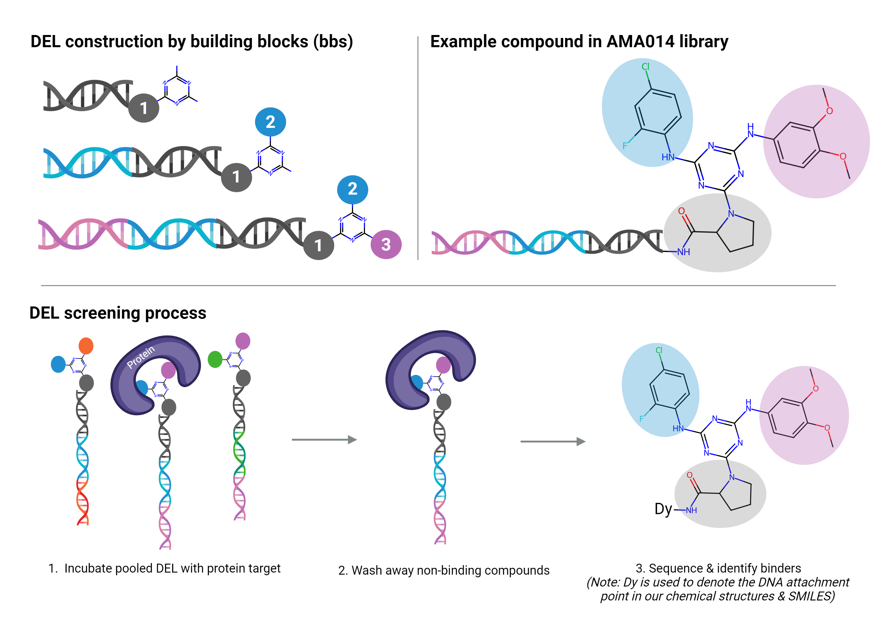

# NeurIPS-2024---Predict-New-Medicines-with-BELKA 
Kaggle competition

Predict small molecule-protein interactions using the Big Encoded Library for Chemical Assessment (BELKA)
https://www.kaggle.com/competitions/leash-BELKA

Leaderboard : https://www.kaggle.com/competitions/leash-BELKA/leaderboard

Dataset : https://www.kaggle.com/datasets/ahmedelfazouan/belka-enc-dataset

Base NoteBook : https://www.kaggle.com/code/ahmedelfazouan/belka-1dcnn-starter-with-all-data

Hello!

I would like to thank Kaggle for organizing such an interesting competition. We also appreciate @ahmedelfazouan for sharing notebooks and dataset that influenced my solution.

Below you can find a outline of how to reproduce my 4th_place solution for the NeurIPS 2024 - Predict New Medicines with BELKA competition.

#ARCHIVE CONTENTS  
solution_4thplace.ipynb	: code to rebuild models and generate predictions 
my.model-0.keras	: model archived 
model-0.h5 : model_weight
requirements.txt
Model_summary.txt

#HARDWARE: (The following specs were used to create the original solution)
Kaggle NoteBook 
Its default CPU(s) (Intel(R) Xeon(R) CPU @ 2.00GHz) and TPU VM v3 

#SOFTWARE (python packages are detailed separately in `requirements.txt`):

#DATA SETUP 
down load pre-processed data from https://www.kaggle.com/datasets/ahmedelfazouan/belka-enc-dataset

#DATA PROCESSING-MODEL BUILD-PREDICTION
run solution_4thplace.ipynb
    a) expect this to run for 3 hrs or so
    b) train all model 

# The Challenge
Traditional drug discovery is a bottlenecked, linear process of testing small molecules one by one against disease-causing proteins. To accelerate this, Leash Biosciences released the Big Encoded Library for Chemical Assessment (BELKA)—a massive, highly imbalanced dataset of 133 million small molecule-protein interactions generated via DNA-encoded chemical libraries (DELs). The machine learning challenge was to predict binding affinities on a scale that pushes standard computational limits, while avoiding data leakage from highly repetitive chemical building blocks.

# The Strategy
While many competing teams relied on bloated, computationally expensive ensembles of Graph Neural Networks (GNNs) and Transformers, my strategy prioritized architecture efficiency and innovative feature engineering.
## Macro-Micro Feature Fusion: 
Chemical data inherently contains highly localized structural information (captured by SMILES strings). To give the model global context, I ran Principal Component Analysis (PCA) on the global chemical space and projected the molecules into a 3D coordinate system. Appending these 3D macro-features to the detailed micro-structural features provided a unique "birds-eye view" of the chemical landscape.
## Streamlined Modeling: 1D Convolutional Neural Network (1D-CNN) that could ingest the entire 133M-row dataset efficiently,  utilizing Google Cloud TPU VMs, which was capable of training across the entire dataset in under three hours, bypassing memory bottlenecks, based on a shared notebook.

# Key Points
The model is a very basic experiment and far from the optimal. You can improve and optimize it. 
- used whole data with TPU
- did PCA and projected data to 3d space 
- appended these to the dataset and trained with 1DCNN + original parameters of the shared notebook.

The keys that set my solution apart from others in the competition might come from simple feature engineering, including reduced dimension chemical space information along with detailed chemical structure information, simple 1D-CNN, and all data.

# DNA-encoded chemical libraries (DELs)
DELs are collections of small molecules, each tagged with a unique DNA barcode. This barcoding system offers a scalable alternative to traditional high-throughput screening, which requires handling individual small molecules in separate tubes. DELs allow for many molecules to be mixed in a single tube and screened simultaneously against a protein target. Molecules that bind to the target are identified through DNA sequencing of their barcodes. DELs are created by chemically combining different building blocks, analogous to building a Mickey Mouse head with different attachments.   

